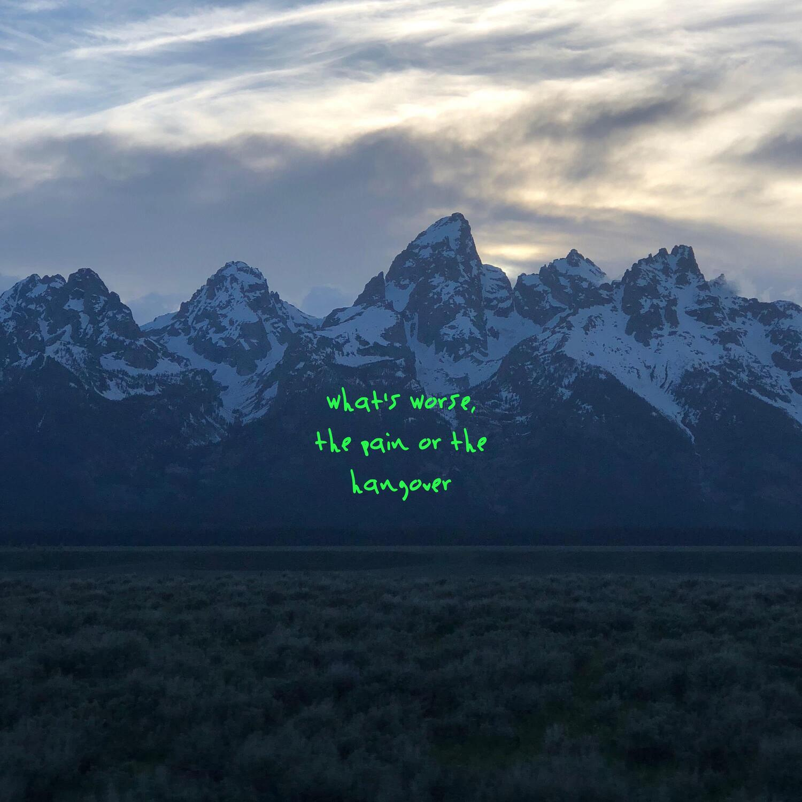

# yenerate

A simple album art generator for Kanye West's 2018 album *ye*.
This python script uses `pillow` to overlay a given text.

The *ye* font only supports `[A-Za-z0-9]`. The input text is broken
into multiple lines so that each line is at most 15 characters long.

